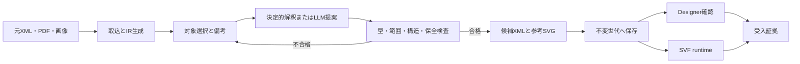

# SVF Form Reproducer

SVF FormData XMLを安全に再構築し、差分検証・世代管理・実行証跡まで一貫して扱うPythonツールです。

[](https://www.python.org/)
[](#テスト)
[](#現在の対応状況)

> [!IMPORTANT]
> ローカル回帰試験は完了していますが、対象SVF・Designer・Windows実機での受入は未実施です。本番利用前に、対象製品・版・SP・フォント・出力経路を登録し、実機受入を行ってください。

## 概要

SVF帳票では、見た目が近いだけでは十分ではありません。Field名、式、キー、RecordとSubFormの関係、文字コード、座標DPIなど、既存XMLに含まれる契約を維持する必要があります。

SVF Form Reproducerは元のFormData XMLを正本として保持し、許可された変更だけを適用します。変更候補は対象IDと備考に結び付け、検査済みのXMLだけを不変の世代として保存します。

画像・PDFからの抽出、few-shotを参照したLLM提案、参考SVG、業務CSVの実行、Designer・runtimeの受入証拠を同じ処理モデルで管理します。

## 解決する課題

- 1属性の修正で、XML全体の改行・宣言・未知属性を壊さない
- 位置由来IDの変化による誤対象編集を防ぐ
- 表示行数Dと業務データ件数Nを独立して扱う
- CSVを含む実行入力を固定し、古い成功結果の再利用を防ぐ
- 結果不明の外部実行を自動再送せず、重複出力を防ぐ
- 検証対象と証拠のハッシュを結び付け、根拠のないpassを防ぐ

## 主な機能

| 領域 | 機能 |
|---|---|
| XML取込 | UTF-8、UTF-16、Shift_JIS系の厳密な読込、DTD・実体拒否、IR生成 |
| 安全な編集 | バッチ中のID固定、許可属性の局所置換、対象外バイトと意味差分の検査 |
| 備考とLLM | 対象選択、備考の追加・修正・取消、古い応答と対象範囲外変更の拒否 |
| 明細設計 | SubForm・Record・表示行数Dを保持し、件数Nと分離して参考表示 |
| 原稿解析 | PDF・画像の文字／領域抽出、OCR接続、明細候補の未確定管理 |
| 世代保存 | 原本・生成物・profile・検証記録を不変世代として保存し、currentを安全に更新 |
| runtime | XML・CSV・mapping・profileを固定し、入力同一性、単一実行、UNKNOWNを管理 |
| 受入記録 | 構造、参考表示、runtime、Designerの結果と証拠を対象世代へ結合 |

## 設計原則

### 元XMLを正本にする

未知ノードや既存属性を作り直しません。属性変更は開始タグ内を局所置換し、対象外バイトの一致と再解析を確認します。構造変更は許可した意味差分だけを受理します。

### profileにない値を推測しない

SVF版、SP、実行OS、座標DPI、enum、フォント、素材、実行コマンドは導入先のprofileへ登録します。未確認の値をfew-shotから補完しません。

### 表示行数Dとデータ件数Nを分ける

`displayLineCount`はXMLの保持・変更・Designer事前確認・設計参考表示に使います。実行時のデータ件数はJobとCSVから決まり、Dを固定上限として扱いません。

### 証拠のない結果を合格にしない

参考SVGは実出力の証明ではありません。Designerとruntimeのpassには、対象世代と一致する非空の証拠、成果物ハッシュ、確認内容が必要です。

## 処理フロー



確定済み帳票への日常出力では、OCRやLLMを再実行しません。受入済み世代とJobを照合し、固定したCSVをSVFへ渡します。実際の改ページとRecord展開はSVFへ委ねます。

## 必要環境

- Python 3.11以降
- 既存XML処理、Job、参考SVG、保存処理は標準ライブラリのみ
- PDF・画像抽出を使う場合は`pypdf`と`Pillow`
- 実出力を使う場合は、導入先SVFを呼び出すコマンドまたは連携プログラム

ロック処理はPOSIXとWindowsで実装を切り替えます。macOSでWindows経路の回帰試験を行っていますが、Windows実機の動作確認は残っています。

## インストール

```bash
python3 -m venv .venv
. .venv/bin/activate
python3 -m pip install -e .
```

PDF・画像抽出も使う場合は追加依存を導入します。

```bash
python3 -m pip install -e '.[extract]'
```

インストール前でもCLIを確認できます。

```bash
python3 bin/svf-reproducer --help
```

## クイックスタート

### 1 profileを準備する

`config/profile.example.json`をコピーし、対象環境で確認した値を設定します。`host_os`、`coordinate_dpi`、`base_xml`を含む必須項目が未設定の場合、検査は失敗します。

```bash
cp config/profile.example.json config/profile.local.json
svf-reproducer profile-validate config/profile.local.json
```

runtimeも使う場合は実行コマンドまで検査します。

```bash
svf-reproducer profile-validate config/profile.local.json --runtime
```

### 2 XMLを取り込み、変更対象を確認する

```bash
svf-reproducer import input.xml config/profile.local.json work --revision base
svf-reproducer targets input.xml config/profile.local.json --kind Record
```

`source_hash`と`target_id`は、取込後の`work/revisions/base/ir.json`または`targets`の結果から取得します。

### 3 備考から変更案を作る

```bash
svf-reproducer annotation-add notes.json SOURCE_HASH \
  "表示行数を10行から12行に変更" TARGET_ID

svf-reproducer resolve input.xml config/profile.local.json notes.json \
  --output changes.json
```

数字が複数あり変更先が曖昧な場合は`COMMENT_AMBIGUOUS`を返します。取消済みの備考は解決処理に入りません。

LLMを使う場合は、profileに`proposal_command`を登録します。few-shotは必要な部品・項目の記法例だけが要求へ添付されます。

```bash
svf-reproducer fewshot-index few-shot.txt config/fewshot-index.json

svf-reproducer propose input.xml config/profile.local.json notes.json proposal.json \
  --fewshot-index config/fewshot-index.json
```

### 4 検査済みXMLを生成する

```bash
svf-reproducer generate input.xml config/profile.local.json changes.json \
  generated.xml --workspace work --revision r002

svf-reproducer render-test generated.xml config/profile.local.json design.svg
svf-reproducer render-test generated.xml config/profile.local.json data.svg \
  --mode data --data-count 0
```

入力と出力が同じファイル、シンボリックリンク、ハードリンクを指す場合は中止します。構造検査に失敗した候補は診断領域へ保存し、旧出力と`current`を維持します。

## 業務データを出力する

Jobの`form_revision`は確定世代と照合します。XML・CSV・mapping・profileは実行専用ディレクトリへ固定し、CSV内容のSHA-256を含む入力IDを作ります。

```bash
svf-reproducer mapping-hash config/mapping.local.json

svf-reproducer run generated.xml job.json config/mapping.local.json \
  config/profile.local.json work output --result-output runtime-result.json

svf-reproducer status work --job-id job-1
```

0件かつ`empty_policy=skip`の場合はSVFを呼ばず`EMPTY`を返します。タイムアウトや起動後の中断は`UNKNOWN`とし、期限切れだけで自動再投入しません。

外部ジョブを照合し、未送信または最終結果を確認できた場合に限り、担当者と根拠を記録して状態を更新します。

```bash
svf-reproducer reconcile work job-1 FAILED \
  --operator 受入担当 --evidence "外部ジョブ照会で未送信を確認"
```

runtimeコマンドでは`{form}`、`{data}`、`{job}`、`{mapping}`、`{profile}`、`{output_dir}`、`{runtime_job_id}`を利用できます。すべて実行専用ディレクトリ内の固定コピーです。

## 検証と受入記録

```bash
PYTHONDONTWRITEBYTECODE=1 PYTHONPATH=src:tests \
  python3 -m unittest discover -s tests -v
```

受入記録は確定世代の複製に作成し、元の世代ディレクトリは変更しません。

```bash
svf-reproducer acceptance-open work r002

svf-reproducer evidence-create work/acceptance/r002/validation.json \
  designer designer-evidence.json designer-check.txt \
  --metadata product=SVFX-Designer \
  --metadata version=9.2 \
  --metadata operator=受入担当 \
  --metadata result="開いて保存できた"

svf-reproducer record-check work/acceptance/r002/validation.json \
  designer pass designer-evidence.json
```

実機比較用の件数計画も生成できます。表示行数Dとは独立に、0、1、2、容量境界と複数ページ相当の件数を確認します。

```bash
svf-reproducer comparison-plan comparison-plan.json --capacity 20
```

## テスト

2026年9月13日時点で、macOS／Python 3.13.5上の79件が成功しています。

- コア試験 27件
- レビュー指摘R01〜R20を受入条件へ変換した回帰試験 45件
- CLI・service・件数境界の統合試験 7件

対象外要素の保全、文字コード、DPI、CSV入力同一性、タイムアウト、UNKNOWN、証拠の鮮度、保存中断、0件、容量境界などを確認します。

## 現在の対応状況

| 項目 | 状態 |
|---|---|
| XML編集・構造検査・世代保存 | ローカル回帰試験済み |
| 備考・LLM提案・CLI／GUIの処理接続 | 統合試験済み。実LLMは未確認 |
| CSV実行・重複防止・証拠管理 | 模擬runtimeで異常系確認済み |
| PDF・画像・OCR | 実装済み。実原稿での精度測定は未実施 |
| Windows | ロック経路の代替試験済み。実機未確認 |
| Designer・実SVF | 未受入 |
| 罫線抽出、複数Recordの容量算定、固有表現 | 一部未対応 |
| 大容量CSV、停電・ストレージ障害 | 未測定 |

詳しい実装範囲と未実施項目は[IMPLEMENTATION_STATUS.md](IMPLEMENTATION_STATUS.md)を参照してください。

## ディレクトリ構成

```text
src/svf_reproducer/   コア、CLI、GUI、検証、保存、runtime
tests/                コア・回帰・統合試験
config/               profile、mapping、Job、few-shot索引の例
examples/             変更指示の例
doc/                  設計、レビュー、修正記録
bin/svf-reproducer    インストール前に使えるCLI入口
```

## ドキュメント

- [実装状況](IMPLEMENTATION_STATUS.md)
- [修正実装記録](doc/修正実装記録.md)
- [実装評価レビューと改善計画](doc/SVF実装評価レビューと改善計画.docx)
- [実装TODOリスト](doc/SVF実装TODOリスト.docx)

few-shotは部品と項目の記法をLLMへ示す参考資料です。例に含まれる名称、座標、数値、表示行数を業務要件や対象版の互換性根拠として扱いません。
