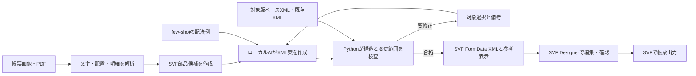

# SVF Form Reproducer

帳票の画像・PDFを解析し、SVF Designerで編集可能なFormData XMLへ変換する、機密環境向けのローカルAI帳票生成ツールです。

[](https://www.python.org/)
[](#テスト)
[](#現在の対応状況)

> [!IMPORTANT]
> 本リポジトリはPoC段階です。画像・PDFの解析、帳票候補の抽出、ベースXMLを使った生成・検証は実装しています。候補から新規SVF XMLまでを一括実行する経路と、対象SVF・Designer・Windows実機での受入は未完了です。

## このプロジェクトを作った理由

客先現場では、完成済みのPDFや画像を見ながら、罫線、文字、入力項目をSVF Designerで一つずつ作り直す作業が発生していました。帳票一式の作成に約1か月かかり、修正のたびに再調整も必要でした。

現場は、長年使われてきた基幹システムと既存資産を大切にし、情報管理にも厳格です。帳票には顧客情報や取引情報が含まれるため、PDFや画像を外部の生成AIへ送る方法は採用できませんでした。

そこで私は、実務で感じた課題を起点に、情報を社外へ出さずに帳票作成を支援する社内DX向けAIプロダクトを企画しました。課題定義、要件整理、設計、実装、テスト、ドキュメント整備まで一貫して担当しています。

客先現場での自主検証では、従来約1か月を要していた帳票作成工程を約1週間まで短縮しました。これは開発者本人による試験結果であり、責任者または客先による正式評価ではありません。

## 対象となる課題

[SVF公式サイト](https://www.wingarc.com/product/svf/index.html)では、2026年2月末時点の導入実績が42,000社以上、国内シェアが70%と紹介されています。また、[外部システム連携の説明](https://www.wingarc.com/product/svf/collaboration/)では、基幹システム刷新やクラウド移行で帳票が課題になりやすいとされています。

長く使われる基幹・業務システムでは、帳票の見本だけが残り、編集可能な設計データが不足している場合があります。人手による作り直しは時間がかかり、担当者の経験に品質が左右されます。

## プロダクト概要

SVF Form Reproducerは、帳票の画像やPDFから文字、配置、明細構造を読み取り、SVFの部品候補へ変換します。ローカルAIがfew-shotの記法例を参照してXML案を作り、利用者は対象を選んで自然文の備考で修正できます。

AIの出力はそのまま採用しません。Pythonが構造、対象範囲、座標、対象SVF版との整合を検査し、SVF Designerで編集できるFormData XMLと参考表示を生成します。既存XMLは、新規生成時のベースや追加修正の入力として任意に利用します。

## 提供する価値

- 帳票を目視で写し直す反復作業を減らす
- 画像の貼り付けではなく、後から編集・再利用できるSVF XMLを作る
- 外部AIへ帳票を送れない環境でも、ローカル処理を選択できる
- AIが迷う箇所を利用者へ返し、備考による修正を次の生成へ反映する
- 明細件数を固定せず、SubFormとRecordの設定に従う汎用帳票を作る
- 生成、確認、修正、再生成を一つの作業履歴として残す

## 主な機能

| 領域 | 機能 |
|---|---|
| 原稿解析 | PDF・画像の文字／領域抽出、OCR接続、明細候補の未確定管理 |
| 帳票構造化 | 固定文字、入力項目、画像、SubForm、Recordなどの部品候補を整理 |
| ローカルAI | few-shotの記法例と利用者の備考から、対象を限定したXML案を作成 |
| XML生成 | 対象版のベースXMLへ検査済みの部品・設定を反映し、編集可能な様式を生成 |
| 修正操作 | 対象選択、備考の追加・修正・取消、古いAI応答の拒否 |
| 明細設計 | SubForm・Record・表示行数Dを保持し、実データ件数Nと分離 |
| 既存資産の利用 | 既存XMLを入力した場合、未知属性や既存設定を保護して必要箇所だけ変更 |
| 世代保存 | 原本・生成物・profile・検証記録を不変世代として保存し、currentを安全に更新 |
| runtime | XML・CSV・mapping・profileを固定し、入力同一性、単一実行、UNKNOWNを管理 |
| 受入記録 | 構造、参考表示、runtime、Designerの結果と証拠を対象世代へ結合 |

## プロダクト設計の判断

### 機密情報を外へ出さない

OCRとLLMはローカル実行を前提とし、外部サービスへの自動切替を行いません。導入先が許可した実行コマンドだけをprofileへ登録します。

### AIに最終判断を任せない

AIは帳票部品とXMLの候補を作ります。対象範囲、構造、値の妥当性はPythonで検査し、曖昧な箇所は利用者へ戻します。自動化と人の判断を分けることで、現場で修正できる設計にしています。

### 編集できる成果物を作る

帳票全体を背景画像として貼り付けるのではなく、文字、Field、罫線、Recordなどの部品へ分解します。生成後もSVF Designerで調整し、業務データと接続できることを目標にしています。

### 既存XMLを使う場合は壊さない

既存XMLをベースや修正対象として読み込んだ場合は、未知ノードや既存属性を作り直しません。変更箇所を限定し、対象外のバイト列と意味差分を検査します。

### profileにない値を推測しない

SVF版、SP、実行OS、座標DPI、enum、フォント、素材、実行コマンドは導入先のprofileへ登録します。未確認の値をfew-shotから補完しません。

### 表示行数Dとデータ件数Nを分ける

`displayLineCount`はXMLの保持・変更・Designer事前確認・設計参考表示に使います。実行時のデータ件数はJobとCSVから決まり、Dを固定上限として扱いません。

### 証拠のない結果を合格にしない

参考SVGは実出力の証明ではありません。Designerとruntimeのpassには、対象世代と一致する非空の証拠、成果物ハッシュ、確認内容が必要です。

## 処理フロー



一度確定した帳票を日常運用で出力するときは、OCRやLLMを再実行しません。確定XMLへ業務データを渡し、SVF本来のRecord展開と改ページを利用します。

## 必要環境

- Python 3.11以降
- 既存XML処理、Job、参考SVG、保存処理は標準ライブラリのみ
- PDF・画像抽出を使う場合は`pypdf`と`Pillow`
- 実出力を使う場合は、導入先SVFを呼び出すコマンドまたは連携プログラム

ロック処理はPOSIXとWindowsで実装を切り替えます。macOSでWindows経路の回帰試験を行っていますが、Windows実機の動作確認は残っています。

## インストール

```bash
python3 -m venv .venv
. .venv/bin/activate
python3 -m pip install -e .
```

PDF・画像抽出も使う場合は追加依存を導入します。

```bash
python3 -m pip install -e '.[extract]'
```

インストール前でもCLIを確認できます。

```bash
python3 bin/svf-reproducer --help
```

## クイックスタート

### 1 profileを準備する

`config/profile.example.json`をコピーし、対象環境で確認した値を設定します。`host_os`、`coordinate_dpi`、`base_xml`を含む必須項目が未設定の場合、検査は失敗します。

```bash
cp config/profile.example.json config/profile.local.json
svf-reproducer profile-validate config/profile.local.json
```

runtimeも使う場合は実行コマンドまで検査します。

```bash
svf-reproducer profile-validate config/profile.local.json --runtime
```

### 2 画像またはPDFを解析する

文字層を持つPDFは文字と配置を抽出します。画像やスキャンPDFでは、profileに登録したローカルOCRを呼び出します。

```bash
svf-reproducer extract source.pdf config/profile.local.json source.json
svf-reproducer candidates source.json candidates.json
```

画像の物理サイズを確定する場合はDPIを指定します。

```bash
svf-reproducer extract source.png config/profile.local.json source.json --dpi 300
```

`source.json`には認識した文字と位置、`candidates.json`には固定項目や明細の候補が保存されます。曖昧な結果は自動確定せず、Issueとして残します。

現行の公開版では、候補から新規SVF XMLまでを一括適用するCLI経路は未接続です。以下は、対象版のベースXMLを使って生成・検証機構を確認する手順です。

### 3 対象版のベースXMLを取り込む

```bash
svf-reproducer import base.xml config/profile.local.json work --revision base
svf-reproducer targets base.xml config/profile.local.json --kind Record
```

`source_hash`と`target_id`は、取込後の`work/revisions/base/ir.json`または`targets`の結果から取得します。

### 4 備考から変更案を作る

```bash
svf-reproducer annotation-add notes.json SOURCE_HASH \
  "表示行数を10行から12行に変更" TARGET_ID

svf-reproducer resolve base.xml config/profile.local.json notes.json \
  --output changes.json
```

数字が複数あり変更先が曖昧な場合は`COMMENT_AMBIGUOUS`を返します。取消済みの備考は解決処理に入りません。

LLMを使う場合は、profileに`proposal_command`を登録します。few-shotは必要な部品・項目の記法例だけが要求へ添付されます。

```bash
svf-reproducer fewshot-index few-shot.txt config/fewshot-index.json

svf-reproducer propose base.xml config/profile.local.json notes.json proposal.json \
  --fewshot-index config/fewshot-index.json
```

### 5 検査済みXMLを生成する

```bash
svf-reproducer generate base.xml config/profile.local.json changes.json \
  generated.xml --workspace work --revision r002

svf-reproducer render-test generated.xml config/profile.local.json design.svg
svf-reproducer render-test generated.xml config/profile.local.json data.svg \
  --mode data --data-count 0
```

入力と出力が同じファイル、シンボリックリンク、ハードリンクを指す場合は中止します。構造検査に失敗した候補は診断領域へ保存し、旧出力と`current`を維持します。

## 業務データを出力する

Jobの`form_revision`は確定世代と照合します。XML・CSV・mapping・profileは実行専用ディレクトリへ固定し、CSV内容のSHA-256を含む入力IDを作ります。

```bash
svf-reproducer mapping-hash config/mapping.local.json

svf-reproducer run generated.xml job.json config/mapping.local.json \
  config/profile.local.json work output --result-output runtime-result.json

svf-reproducer status work --job-id job-1
```

0件かつ`empty_policy=skip`の場合はSVFを呼ばず`EMPTY`を返します。タイムアウトや起動後の中断は`UNKNOWN`とし、期限切れだけで自動再投入しません。

外部ジョブを照合し、未送信または最終結果を確認できた場合に限り、担当者と根拠を記録して状態を更新します。

```bash
svf-reproducer reconcile work job-1 FAILED \
  --operator 受入担当 --evidence "外部ジョブ照会で未送信を確認"
```

runtimeコマンドでは`{form}`、`{data}`、`{job}`、`{mapping}`、`{profile}`、`{output_dir}`、`{runtime_job_id}`を利用できます。すべて実行専用ディレクトリ内の固定コピーです。

## 検証と受入記録

```bash
PYTHONDONTWRITEBYTECODE=1 PYTHONPATH=src:tests \
  python3 -m unittest discover -s tests -v
```

受入記録は確定世代の複製に作成し、元の世代ディレクトリは変更しません。

```bash
svf-reproducer acceptance-open work r002

svf-reproducer evidence-create work/acceptance/r002/validation.json \
  designer designer-evidence.json designer-check.txt \
  --metadata product=SVFX-Designer \
  --metadata version=9.2 \
  --metadata operator=受入担当 \
  --metadata result="開いて保存できた"

svf-reproducer record-check work/acceptance/r002/validation.json \
  designer pass designer-evidence.json
```

実機比較用の件数計画も生成できます。表示行数Dとは独立に、0、1、2、容量境界と複数ページ相当の件数を確認します。

```bash
svf-reproducer comparison-plan comparison-plan.json --capacity 20
```

## テスト

2026年9月13日時点で、macOS／Python 3.13.5上の79件が成功しています。

- コア試験 27件
- レビュー指摘R01〜R20を受入条件へ変換した回帰試験 45件
- CLI・service・件数境界の統合試験 7件

対象外要素の保全、文字コード、DPI、CSV入力同一性、タイムアウト、UNKNOWN、証拠の鮮度、保存中断、0件、容量境界などを確認します。

## 現在の対応状況

| 項目 | 状態 |
|---|---|
| 客先現場での工程短縮 | 約1か月から約1週間へ短縮した自主検証実績。正式評価は未実施 |
| PDF・画像解析と候補抽出 | 実装済み。実原稿を使った精度測定は未実施 |
| 候補から新規XMLまでの一括生成 | CLI／GUIへの接続が未完了 |
| ベースXMLへの生成・構造検査・世代保存 | ローカル回帰試験済み |
| 備考・LLM提案・CLI／GUIの処理接続 | 統合試験済み。実LLMは未確認 |
| CSV実行・重複防止・証拠管理 | 模擬runtimeで異常系確認済み |
| Windows | ロック経路の代替試験済み。実機未確認 |
| Designer・実SVF | 未受入 |
| 罫線抽出、複数Recordの容量算定、固有表現 | 一部未対応 |
| 大容量CSV、停電・ストレージ障害 | 未測定 |

詳しい実装範囲と未実施項目は[IMPLEMENTATION_STATUS.md](IMPLEMENTATION_STATUS.md)を参照してください。

## ディレクトリ構成

```text
src/svf_reproducer/   コア、CLI、GUI、検証、保存、runtime
tests/                コア・回帰・統合試験
config/               profile、mapping、Job、few-shot索引の例
examples/             変更指示の例
doc/                  設計、レビュー、修正記録
bin/svf-reproducer    インストール前に使えるCLI入口
```

## ドキュメント

- [実装状況](IMPLEMENTATION_STATUS.md)
- [修正実装記録](doc/修正実装記録.md)
- [実装評価レビューと改善計画](doc/SVF実装評価レビューと改善計画.docx)
- [実装TODOリスト](doc/SVF実装TODOリスト.docx)

few-shotは部品と項目の記法をLLMへ示す参考資料です。例に含まれる名称、座標、数値、表示行数を業務要件や対象版の互換性根拠として扱いません。
